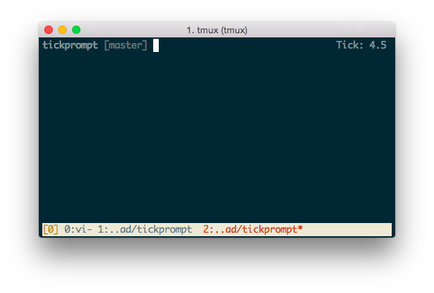

# Tickprompt

> "Have you done your tick?" - **Project Manager, Rawnet**

At [work](http://rawnet.com) we track our time using [Tick](http://www.tickspot.com/), but I **really** suck at keeping timesheets!  
So I wrote this little dealy to sit in my shell prompt and remind me how much time I've recorded so far today.

Here's how it looks:



## What does it actually do?

When you run:

```
$ tickprompt show
```

It checks for a cache file called `~/.tickprompt` and if it's missing or the cache has expired it'll start a background process:

```
$ tickprompt update
```

Which polls the [Tick API](https://github.com/tick/tick-api/blob/master/sections/entries.md) and sums the hours recorded for today.

## Configuring it

You configure it with these environment variables:

- TICKPROMPT_SUBSCRIPTION_ID
- TICKPROMPT_API_TOKEN
- TICKPROMPT_USER_ID
- TICKPROMPT_CACHE_TTL
